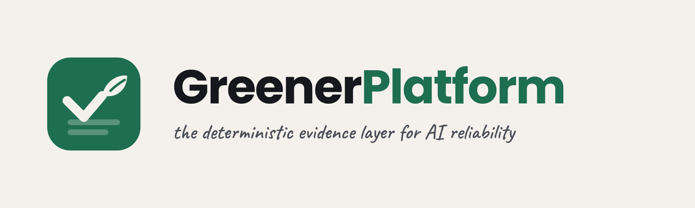

  

## GreenerPlatform

**Deterministic first, AI for reasoning.** Open-source SRE and platform tools for
Kubernetes — the deterministic *evidence layer* an AI or agent reasons over, instead of
another LLM guessing at your cluster.

As AI moves into operations, the moat is not a smarter model — it is evidence the model
is **bounded by**: reproducible, auditable, CI-safe. We call it **AIReliability**.

### What we build
- **[kubectl-sentinel](https://github.com/GreenerPlatform/kubectl-sentinel)** — a point-in-time cluster health snapshot across 15 dimensions, with severity rules and a fix command on every finding. Structured JSON, exit codes, runs in CI with no internet.
- **[incident-triage](https://github.com/GreenerPlatform/incident-triage)** — alert × snapshot → causation chain + prioritized fix plan. Deterministic Python, standard library only.
- **[greenerplatform-mcp](https://github.com/GreenerPlatform/greenerplatform-mcp)** — an MCP server that exposes both tools to any agent (Cursor, Claude, VS Code, Windsurf). The reasoning layer, grounded in observed facts.

### The rule of the stack
Each layer may reason, but only the bottom layer establishes fact. The deterministic
tools stay dependency-light and testable; the AI is optional and bounded by the evidence.
We stay *out* of what the observability stack already owns — metrics, logs, traces — and
out of security posture. We are the reliability evidence those systems act on.

**→ Start with [kubectl-sentinel](https://github.com/GreenerPlatform/kubectl-sentinel)**, or read the full [VISION](../VISION.md).
